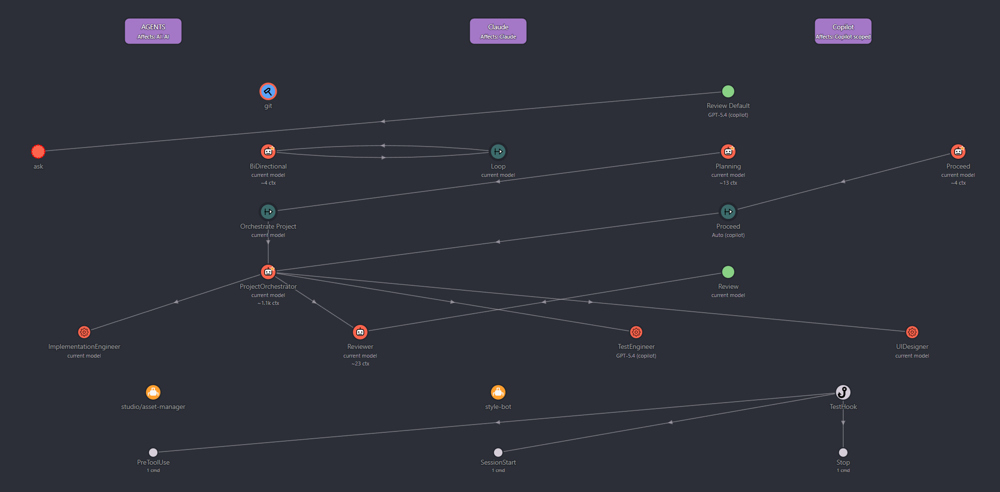

# Copilot AI Customization Visualizer

Copilot AI Customization Visualizer is a VS Code extension for inspecting and editing project Copilot AI customization files from one visual workspace. It maps custom agents, prompt files, instruction files, hooks, model choices, sub-agent links, and active tools into an interactive graph.

Author: [Jeffe747@github](https://marketplace.visualstudio.com/search?term=publisher%3A%22Jeffe747%22&target=VSCode&category=All%20categories&sortBy=Relevance)

Releases: Get it [here](https://github.com/Jeffe747/AI_Customization_Visualizer/releases) or [build](https://github.com/Jeffe747/AI-Customization-Visualizer/blob/main/vsix.bat) it yourself.

Copilot AI Customization Visualizer has been AI-engineered with GPT-5.5

## Usage

Open the `Copilot AI Customization Visualizer` activity bar view to inspect the current workspace. Select a node to edit its metadata and system prompt, then use `Save` or `Ctrl+S` to write changes back to the source file.

Zoom in the visuaizer with `Ctrl+Scrollwheel`. 
Drag around with the mouse.

Use the toolbar settings button to adjust graph element size and editor text size.

## Contributing to development

If want to contribute to the development of this extension, then make a pull-request with *.md files, that outlines the suggestion and steps needed for an AI to implement it.